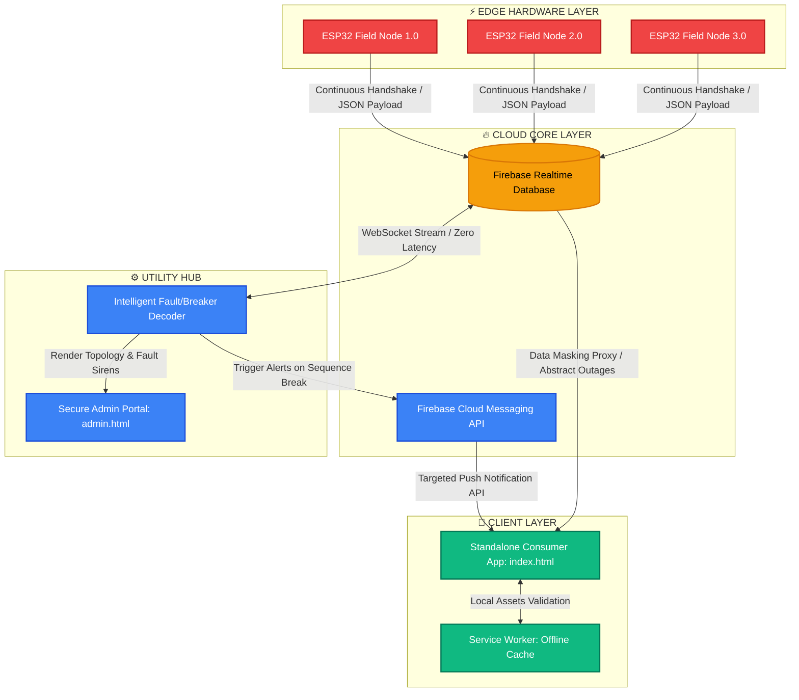

markdown
# 🔋 Kalkini Power Monitor (KPM) v3.0 — Enterprise Smart Grid Monitoring System

A decentralized, cloud-integrated IoT ecosystem designed to track real-time grid telemetry, automate fault localization, and decode sub-station anomalies without relying on expensive, legacy SCADA infrastructure. 

> 🔒 **Repository Note:** The production source code (including Firebase Security Rules, ESP32 Firmware C++, and Client Data-Masking Proxies) is kept strictly **PRIVATE** due to commercial sensitivity, local utility infrastructure security, and intellectual property rights. This README serves as a comprehensive **System Architecture & Technical Documentation Overview** for global tech evaluation.

---

## 🛠️ System Architecture Layer (Decentralized IoT Framework)

The system is engineered using a robust, decoupled **4-Tier Architecture** to achieve high scaling, sub-millisecond data synchronization, and zero server-side maintenance.




## 🧠 Core Engineering Innovatons & Algorithms

### 1. Sequential Micro-Zone Fault Localization (Chain Breakdown Model)
Instead of expensive transformer-level hardware metrics, KPM maps local grid regions using a dynamic **Sequential Chaining Array** (`Node[1] -> Node[2] -> Node[3]`).
* **The Logic:** The backend processing loop continuously evaluates sorted node sequence indices. If `Node[i].status === "Online"` but `Node[i+1].status === "Offline"`, the network instantly detects a physical sequence break.
* **The Result:** The interface immediately raises a **CRITICAL FAULT** siren and isolates the hazard zone strictly between those two geo-locations, shrinking the search perimeter from a 10km grid to under 500 meters for dispatch teams.

### 2. The Breaker Tripping vs. Load-Shedding Decoder
A notorious constraint in rural grids is the absence of local **Dropout Fuses (DO Fuses)**, causing a localized grid failure to instantly trip the main sub-station breaker, dropping all downstream nodes simultaneously. KPM bypasses this physical bottleneck programmatically via a **Master-Switch State Machine**:
* **Scenario A (Official Outage):** If all concurrent nodes drop on a feeder and the sub-station's dynamic Master Switch state is tracked as **OFF**, the dashboard handles it as an intentional power-cut: `⚠️ INFO: Official Load-Shedding Active`.
* **Scenario B (Grid Failure / Surge):** If all nodes drop simultaneously but the Master Switch remains **ON**, the system decodes it as an emergency structural event: `🚨 BREAKING ALERT: Sub-station Breaker Tripped (Major Line Fault)`. It then extracts millisecond **Last-Ping Timestamps** to isolate where the high-voltage transient surge first impacted the array.

### 3. Asymmetric Security Proxies & Client Data-Masking
To prevent grid telemetry data leaks, avoid public panic, and secure critical infrastructure, the frontend implements an **asymmetric data abstraction layer**. 
* **Public Tier:** Raw sensor breakdowns and sequence crashes are filtered out on consumer clients; user interfaces render a simplified, abstracted `Online (🟢)` or `Offline (🔴)` state.
* **Admin Tier:** Full multi-feeder diagnostics, live hazard zones, line-loss estimations, and CRUD network configurations are accessible exclusively through an authenticated administration gate.

---

## 📂 Production NoSQL NoSQL Data Schematics (Firebase Model)

The database utilizes a highly normalized, dynamic NoSQL JSON structure to allow fluid network additions via the Admin Portal without requiring backend code changes:

```json
{
  "kalkini_power_monitor": {
    "system_control": {
      "last_updated": "2026-07-07 11:20:00"
    },
    "feeders": {
      "feeder_khaserhat": {
        "name": "খাসেরহাট ফিডার",
        "status": "Online"
      }
    },
    "areas": {
      "area_4201": {
        "name": "খাসেরহাট বাজার",
        "feeder_id": "feeder_khaserhat",
        "status": "Online",
        "nodes": {
          "node_1_main": {
            "name": "খাসেরহাট মেইন মোড়",
            "status": "Online",
            "sequence": 1,
            "last_ping": "2026-07-07 11:20:00"
          },
          "node_2_school": {
            "name": "খাসেরহাট স্কুল রোড",
            "status": "Offline",
            "sequence": 2,
            "last_ping": "2026-07-07 11:18:42"
          }
        }
      }
    }
  }
}
```

---

## ⚡ Progressive Web App (PWA) Offline Engineering
To survive harsh deployment fields with unstable networks, the system is fully decoupled into an installable standalone application utilizing native browser storage optimization:
* **Standalone UI Context:** Custom configuration files target specific application parameters (`display: standalone`), entirely stripping away default browser search fields and URL frames to render a pure native app runtime across **Windows, Android, and iOS (Safari)**.
* **Asynchronous Caching Framework:** The background `service-worker.js` listens to incoming data pipelines, securely intercepting network payloads to execute isolated local caching via `caches.match`. This guarantees that if a lineman opens the application in a zero-network dead zone, the complete UI scaffolding, map structures, and offline charting elements remain fully functional.

---

## 📈 R&D Scalability Roadmap (Next Enterprise Phases)
* **Three-Phase Load Balance Optimization:** Interfacing **SCT-013 CT Sensors** with the ESP32 array to execute live amperage variance analysis; triggering alerts if current load deviates over 15% across R, Y, and B phases to prevent transformer burnouts.
* **Predictive Thermal Overhead Warnings:** Modeling historic power curves to detect overheating thresholds on critical transformers before a physical terminal explosion happens.
* **Differential Distribution Loss Analysis:** Calculating variance between sub-station feeder outputs

## Project Live link
<a href="https://kalkinipowermonitor.web.app/" target="_blank">
  
</a>

